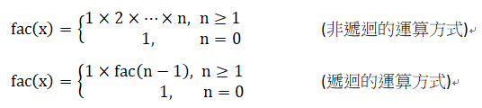

# 函數

簡化程式的結構，也可以節省相同程式碼的時間。

```java
public static 傳回值 函數名稱 (型態 引數1, 型態 引數2)
{
    程式敘述;
    return 運算式;
}
```
(如果不需要傳遞引數到函數中,此時只要將左右括號寫出,不必填入任何內容。另外 如果函數沒有傳回值,則return 叙述可以省略。

* void: 設定不回傳值的關鍵字

> 在本章裡,函數之前的關鍵字 public static 是固定的用法,冠上public的目的是為了使 得它可以在main() 函數裡被呼叫,static 的目的是讓函數可以在不建立物件的情況下被 呼叫。由於這些觀念都牽涉到類別的知識,在下個章節中我們會陸續提及,此時您只 要知道如何使用即可。

### 函數的引數與傳回值

* 如果函數有傳回值,**在定義函數時就必須指定傳回的資料型態**。  
相同的,如果有引數要傳遞到函數內,則函數的括號內必須填上所有的引數及其型態。

* 在JAVA裡，所有資料型態的變數，其傳遞到函數的方式均是以「傳值」(pass by value)的方式來進行。

```java
public static void main(String args[])
    {
     public static void add10(int value)
        {

        }
    }
```

## 陣列的傳遞機制

稍早我們曾提及,在傳遞基本資料型態的變數到函數時,Java 會把該變數拷貝一份, 再傳遞這份拷貝的變數,這個做法也就是「傳值」的機制。然而,如果是傳遞陣列, 或者是傳遞由類別所建立的物件時,則以「傳參照」(pass by reference)的方式進行。


# 遞迴 (recursive)
> 所謂的遞迴就是函數本身呼叫自已。

  
  
* 使用遞迴函數可以讓程式碼變得簡潔,許多時候也可提升執行的效率
* 但是使用時必須注意到遞迴函數一定要有可以結束執行的終止條件,使得函數得以返回上層呼叫的地方,否則容易造成無窮迴圈,最後因系統預留的堆疊(stack)空間不足而當掉。

# 多載 (overloading)

是指相同的函數名稱,如果引數個數不同,或者是引數個數相同、 型態卻不同的話,函數便具有不同的功能。


