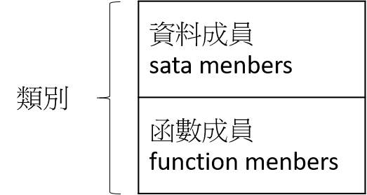

# 類別
> 是把事物的資料與相關功能「封裝」(encapsulate)在一起所形成一種特殊的結構,  
> 用以表達真實事物的一種抽象概念。



透過封裝,外界可以透過特定的方式取得類別裡不能直接被存取的資料,藉以維護物件的安全性

* 資料成員(field)：描述類別的各種屬性
* 函數成員(method)：描述類別可以執行的工作

## 類別的定義格式

```java
class 類別名稱
{
    資料型態 field 名稱;    // 宣告
    ...                    // field

    傳回值的資料型態 函數名稱 (引數1, 引數2, ...)
    {
        程式敘述;       // 函數的本體
        return 運算式;  // (body)
    }
}
```

範例： 以**矩形**為例
* 資料成員： width 與 height
* 函數成員： area()