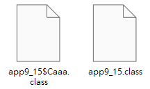
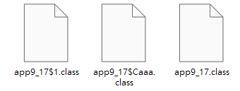

# 建構元 (constructor)
> 幫助新建立的物件設定初值

```java
修飾子 類別名稱 (型態1 引數1, 型態2 引數2)
{
    程式敘述;
    ....    // 建構元沒有傳回值
}

```
* 修飾子： 可以是 public 或 private
* 類別名稱：必須和**類別名稱**相同
* 不能有回傳值

## 呼叫時機

在建立物件時便會自動呼叫，並執行建構元的內容  
--> 可用作物件資料成員的**初始化(initialization)**

## 建構元的多載

與 函數 相同，建構元可以進行多載

## 兩建構元之間的呼叫：透過關鍵字達成
```java
this()
```
※ 不能以建構元直接呼叫，否則編譯時將發生錯誤

## 建構元的公有與私有

* public: 可以在程式的任何地方被呼叫，新建立的物件均可自動呼叫它
* private:無法在該建構元所在類別以外的地方被呼叫

## 建構元的省略

* 當程式中沒有撰寫建構元時，JAVA會自動呼叫**預設的建構元(default constructor)**
    ```java
    public CCircle() // 預設的建構元
    {

    }
    ```
* 如果我們自行設計一個沒有引數的建構元，在建立物件時會自動呼叫該建構元，而不會呼叫預設的建構元

※ 特點：
1. 建構元的名稱 = 類別名稱
2. 建構元裡沒有引數
3. 建構元內沒有任何敘述
   

## 實例變數與類別變數

* 實例變數 (instance variable) : 變數各自獨立且存放於不同的記憶體
* 類別變數 (class variable) : 由所有物件共享
  
### 類別變數：可用來節省記憶體空間
> 需要在變數前面加上修飾子
```java
static
```
e.g. CCircle類別裡的變數pi
```java
private static double pi = 3.14;
```

## 實例函數與類別函數

* 實例函數 (instance method): 必須先建立物件，再自物件呼叫的函數
* 類別函數 (class method): 直接由類別來呼叫，而不用透過物件

### 類別函數：可以直接由類別來呼叫，而不需通過物件
> 需要在變數前面加上修飾子
```java
static
```
* 可以在不產生物件的情況下直接以類別來呼叫
* 類別函數無法取用「實例變數」與「實例函數」
* 類別函數內部不能使用 ```this```關鍵字取用源自物件的類別

#### main() 函數 與 static 修飾子
使 main()函數變成一個「類別函數」，於編譯完成時JAVA直接使用類別 **app9_7** 來呼叫 **main()**

# 類別型態的變數

區分
   1. 基本型態的變數：由關鍵字宣告而得的變數
   2. 非基本型態的變數(類別型態的變數)：由類別宣告而得的變數


## 以類別型態的變數傳遞引數

1. 比較 呼叫它的物件 cir1 與 compare() 裡的引數 cir2 之資料成員是否完全相同
   ```java
    cir1.compare(cir2)
   ```
   ```java
    傳回值型態 compare(CCircle obj)
    {

    }
   ```
2. 比較 this 與 cir 是否指向同一個物件
   ```java
    if(this == cir)
   ```

## 由函數回傳類別函數的變數
> 在函數定義的前方加上該類別的名稱即可

e.g. app9_11.java
```java
CCircle compare(CCircle obj)
{

}
```

# 利用陣列來儲存物件

1. 建立類別型態的陣列
2. 將變數指陣列指向物件陣列

※ 範例：建立一個物件陣列，內含三個CCircle型態的物件
1. 建立CCircle類別型態的陣列
   * <法一> 先宣告CCircle型態的陣列，再配置記憶體空間給cir
    ```java
       CCircle cir[];
       cir = new CCircle[3];
    ```
   * <法二> 建立類別型態的陣列同時配置記憶體空間
    ```java
       CCircle cir[] = new CCircle[3];
    ```
2. 將每個陣列元素指向由CCircle類別所建立的物件
   * <法一> 逐一建立
      ```java
      cir[0] = new CCircle();
      cir[1] = new CCircle();
      cir[2] = new CCircle();
      ```
   * <法二> 利用迴圈建立
      ```java
      for (int i = 0 l i< cir.length;i++)
      {
        cir[i] = new CCircle();
      }
      ```

> 欲使用陣列物件，需使用兩次new運算子來配置記憶體空間
> 1. 配置記憶體空間給類別型態的陣列
> 2. 配置記憶體空間給物件陣列


## 傳遞物件陣列到函數裡

e.g. app9_13.java

# 內部物件

* 巢狀物件 (nested classes) : 於類別內再定義一個類別
  * 外部類別 (outer class)
  * 內部類別 (inner class)
```java
修飾子 class 外部類別的名稱
{   

    // 外部類別的成員ㄋ

    修飾子 class 內部類別的名稱
    {
        // 內部類別的成員
    }
}
```

e.g. app9_14
```java
class Caaa    // 定義 CRectangle 類別
{
    // 外部類別成員
    int num;
    void set_num(int n)
    {
        num = n;
        System.out.println("num = "+num);
    }
}

public class app9_14
{
    public static void main(String args[])
    {
        Caaa aa = new Caaa();           // 利用new配置記憶體空間    
        aa.set_num(5);;
    }
}
```

將 class Caaa 改寫為內部類別
```java
public class app9_15
{
    public static void main(String args[])
    {
        Caaa aa = new Caaa();           // 利用new配置記憶體空間    
        aa.set_num(5);;
    }

    static class Caaa    // 定義 Caaa 類別 : 內部類別
    {
        // 外部類別成員
        int num;
        void set_num(int n)
        {
            num = n;
            System.out.println("num = "+num);
        }
    }

}
```
※ 當有程式使用內部類別時，JAVA會用```$```區分該內部類別是屬於哪個外部類別。
```
外部類別名稱 $ 內部類別名稱
```


### 在外部類別的建構元裡建立內部類別的物件
1. 在外部類別的建構元裡建立內部類別的物件
2. 在 main()裡建立一個外部類別的物件

```java
public class app9_16 //外部類別
{
    public app9_16()   // 外部類別的建構元
    {
        Caaa aa = new Caaa();     // 在外部類別的建構元裡    
        aa.set_num(5);         // 建立內部類別的物件
    }

    public static void main(String args[])
    {
        app9_16 obj = new app9_16(); // 呼叫建構元 app9_16 建立外部類別的物件
    }

    static class Caaa    // 定義 Caaa 類別 : 內部類別
    {
        // 外部類別成員
        int num;
        void set_num(int n)
        {
            num = n;
            System.out.println("num = "+num);
        }
    }

}
```

### 匿名內部類別 (anonymous inner class)
> 利用內部類別建立不具名稱的物件，並利用它存取到類別裡的成員

* 補足內部類別沒有定義到的函數
* 有效地簡化程式碼
* 若程式中只會使用到一次這個類別，可以將該函數撰寫成匿名內部類別
* 在JAVA的視窗程式設計裡，常會利用「匿名內部物件」來撰寫「事件」(event)

```java
(
    new 類別成員 (引數)
    {
        傳回值型態 函數名稱 (引數1,引數2,...,引數n)
        {
            函數敘述;
        }

    }
).函數名稱(引數1,引數2,...,引數n)
```

e.g.
```java
public class app9_17 //外部類別
{
    public static void main(String args[])
    {
        (
            new Caaa()          // 建立匿名內部類別 Caaa的物件
            {
                void set_num(int n) //補足內部類別Caaa裡沒有定義到的函數
                {
                    num = n;
                    System.out.println("num = "+num);
                }
            }
        ).set_num(5);   // 執行匿名內部類別所定義的函數
            
    }           

    static class Caaa
    {
        int num;
    }
}
```

※ 當有程式使用匿名內部類別時，JAVA會用```$```區分該內部類別是屬於哪個外部類別。
```
外部類別名稱 $ 數字編號
```



## 類別裡的其他成員

```java
修飾子 class 外部類別名稱
{
    // 外部類別的成員
    資料型態 內部類別名稱 變數名稱; // 內部類別的變數

    修飾子 class 內部類別名稱
    {
         // 內部類別的成員
    }
}

```

e.g. CBox 類別：用來記錄箱子的長、寬、高；成員類別 Color則記錄箱子的顏色 (app9_19)
```java
class CBox                  // 外部類別
{
    private int length;     // CBox 類別物件的長
    private int width;      // CBox 類別物件的寬
    private int height;     // CBox 類別物件的高
    private CColor cr;      // CBox 類別物件的物件變數cr，用以表示顏色

    class CColor            // 內部類別
    {
        String color;       // CColor 類別的資料成員，表示顏色
    }
}
```

# 巢狀類別
> 當我們要特別強調類別與類別之間的特殊關係時，可以使用

1. 當外部類別定義成 public 時,其內部類別也擁有 public 的權限。

2. 巢狀類別裡的內部類別為外部類別的成員之一,因此外部類別的成員可以存 取、呼叫內部類別裡的成員:內部類別的成員同樣也可以存取、呼叫外部類 別裡的成員,不受private 的限制。

※ 使巢狀類別簡單易懂：  
將所有的函數成員寫在外部類別，內部類別只留資料成員與建構元  
以簡化內部類別亦可方便管理巢狀類別的函數成員

# 回收記憶體

Java 提供的資源回收機制,是屬於**系統層級的執行緒(system-level thread)**,  
程式設計師只要撰寫相關的指令告訴JVM,目前程式需要做資源回收的動作,  
則JVM會控制資源回收機制,決定回收物件的時間。  
我們也可以提出要求資源回收,**真正在處理回收的時機還是交由JVM決定,不一定會馬上處理程式的要求**。

1. 將指向該物件的變數值設為```null```
    ```java
    class app
    {
        public static void main(String args[])
        {
            CCircle cir1 = CCircle();
            ...
            cir1 = null;    // 將 cir1 指向null，代表cir1 已不再指向任何物件
            ...
        }
    }
    ```

    若兩個類別型態的變數都指向同一個物件，並將其中之一設為```null```。  
    由於另一個變數還是指向他，JAVA的蒐集殘餘記憶體機制並不會回收它。
2. 程式在執行結束時，JAVA的蒐集殘餘記憶體機制還是會自動回收先前所有被配置的記憶體空間。

## 強制回收機制的函數
> 雖然是「強制執行」,至於何時啟動資源回收機制,還是由JVM視情況決定,  
> 並不能保證一收到指令即立刻執行回收的動作。
1.  System.gc()
2. Runtime.gc()